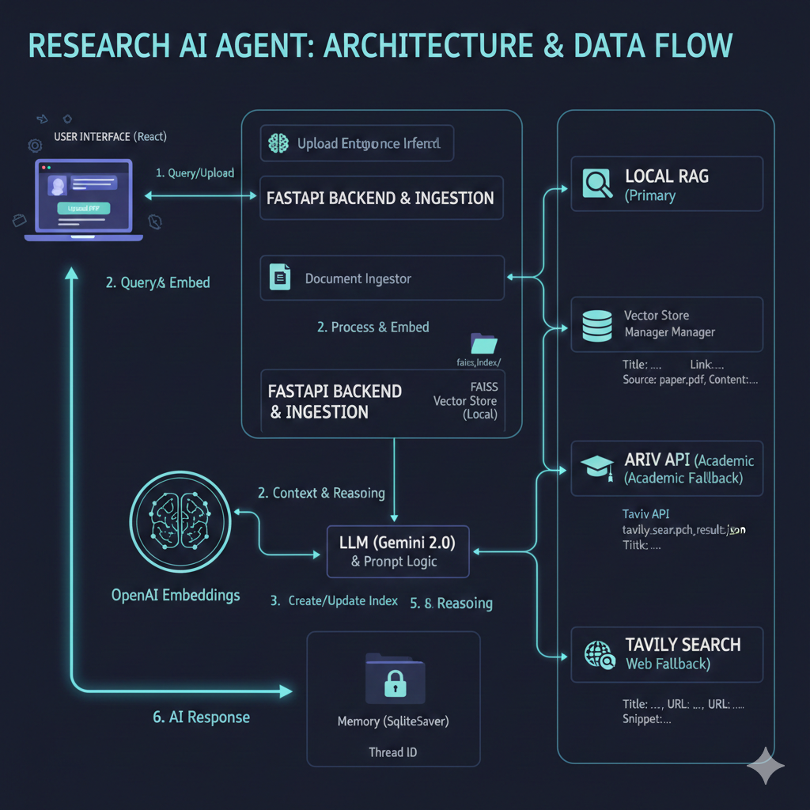

# 📄 Research AI: Multi-Source Agentic RAG
> **An Advanced Research Assistant powered by LangGraph, Gemini 2.0, and a Triple-Source Intelligence System.**

---

## 🌟 Overview
**Research AI** is an Agentic Retrieval-Augmented Generation (RAG) system designed to bridge the gap between static document analysis and real-time research. Unlike traditional RAG systems that only look at local files, this agent features a **Multi-Tool Routing logic** that allows it to intelligently navigate three distinct data layers:

1.  **Local Deep-Dive**: Analyzes locally uploaded PDF research papers using **FAISS vector storage**.
2.  **Academic Scout**: Searches the global academic landscape via the **ArXiv API** for papers not present in the local database.
3.  **Live Web Browsing**: Leverages **Tavily Search** to provide real-time implementation details and current AI news.

---

## 🛠️ Technical Stack
* **LLM Intelligence**: Google Gemini 2.0 Flash (via OpenRouter)
* **Orchestration**: LangGraph (State-based agentic workflows)
* **Vector Database**: FAISS (Facebook AI Similarity Search)
* **Embeddings**: OpenAI `text-embedding-3-small` (Optimized for performance)
* **External APIs**: ArXiv (Academic), Tavily (Web Search)
* **Backend**: FastAPI (Asynchronous, high-performance)
* **Frontend**: React (Modern, responsive UI)

---



## 🏗️ Architecture
The system utilizes a **StateGraph architecture** to manage complex, non-linear conversation flows:

1.  **State Management**: Uses `MemorySaver` to maintain persistent context across multi-turn research sessions.
2.  **Agent Node**: Evaluates user intent and generates dynamic tool calls based on the query.
3.  **Tool Node**: Executes specialized Python functions for FAISS search, ArXiv lookups, or Tavily web queries.

---


## 🚀 Getting Started

### 1. Prerequisites
* Python 3.10+
* Node.js (for the React frontend)
* API keys for OpenRouter and Tavily and Huggingface 


### 2. Installation
```bash
# Clone the repository

git clone [https://github.com/onkar-2006/assestment-Research-AI.git](https://github.com/onkar-2006/assestment-Research-AI.git)
cd research-ai-agent

# Set up the environment
python -m venv venv
source venv/bin/activate 
pip install -r requirements.txt

# Create a .env file in the root directory:

OPENROUTER_API_KEY=your_openrouter_key
TAVILY_API_KEY=your_tavily_key
HF_TOKEN="XXXXXXXXXX"

# Start the Backend
cd backend
python main.py

# Start the Frontend
cd 
npm install
npm run dev 

